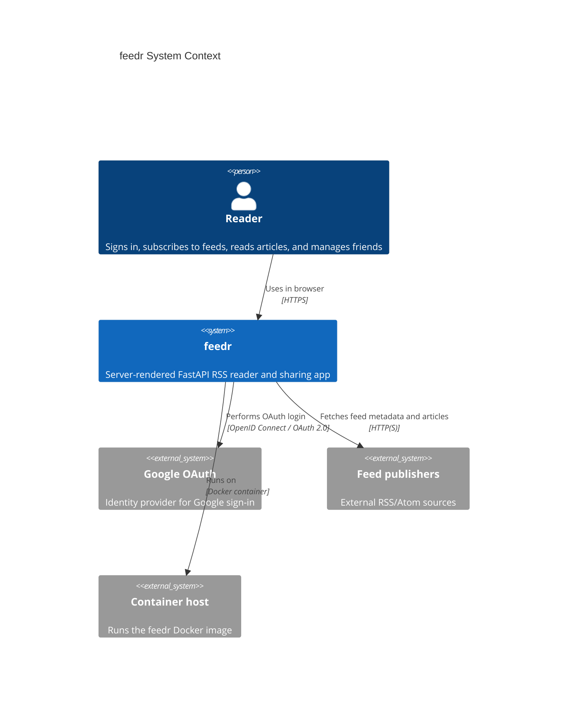
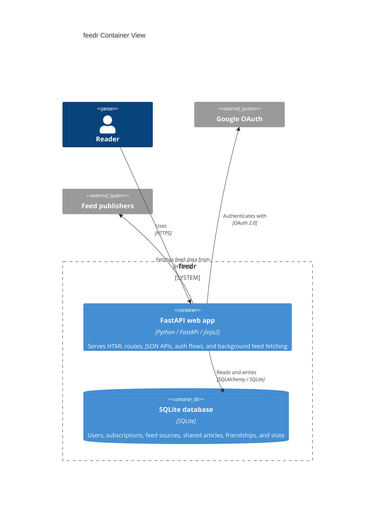
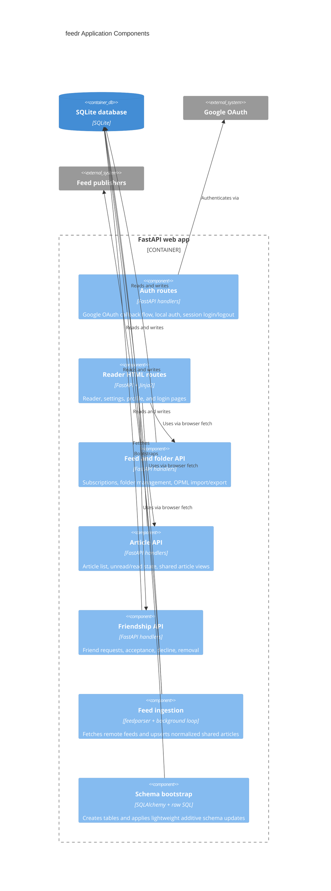

# Architecture Overview

This document describes the current `feedr` application structure as it exists in the repository today.

## System Context

## Container View

## Component View

## Request and Data Flows

### Login Flow

1. A user opens `/login`.
2. The user signs in with Google or local auth.
3. The app stores session data in the Starlette session cookie.
4. `get_current_user()` resolves or creates the matching `User` record.

### Feed Subscription Flow

1. The reader posts a feed URL to `/api/feeds`.
2. The app normalizes the URL and checks for an existing subscription.
3. The app probes the remote feed with `feedparser`.
4. The app creates or reuses a normalized `FeedSource`.
5. The app creates a user-specific `FeedSubscription`.
6. The app immediately fetches articles into `SharedArticle` rows.

### Article Reading Flow

1. The reader loads `/reader`.
2. Inline JavaScript calls `/api/feeds` and `/api/articles`.
3. Articles are filtered against the current user's `UserArticleState` rows.
4. Read and unread mutations update `UserArticleState`.
5. The reader defaults to unread-only mode in the UI.

### Sharing and Friendship Flow

1. Users send friend requests with `/api/friends/request`.
2. The addressee accepts or declines through the reader sidebar or `/reader/profile`.
3. Accepted friendships allow article sharing visibility.
4. Shared-article queries resolve accepted friend ids and return deduplicated article results with sharer metadata.

### Background Fetch Flow

1. The in-process background thread loops over all `FeedSource` rows.
2. Each source is fetched from the remote publisher.
3. New items are deduplicated by canonical key and stored as `SharedArticle` rows.
4. Fetch metadata such as `etag`, `last_modified`, and status is persisted on the source.

## Data Model Summary

The app still carries some legacy v1 tables, but most active reader behavior now works against the normalized v2 schema.

### Legacy Tables

- `users`
- `folders`
- `feeds`
- `articles`
- `read_states`

### Active v2 Tables

- `feed_sources`: canonical remote feeds
- `feed_subscriptions`: per-user subscription records
- `shared_articles`: normalized article rows for each source
- `user_article_states`: per-user read/star state for shared articles
- `friendships`: pending and accepted friend relationships
- `article_shares`: user-level article sharing records

## Current Runtime Characteristics

- Single FastAPI process handles HTML, APIs, and background fetching.
- SQLite is the default and best fit for local or single-node container deployment.
- Sessions are cookie-based through Starlette middleware.
- UI rendering is server-side, but most reader interactions happen through browser fetch calls to JSON endpoints.
- Schema evolution is currently additive and handled in app startup rather than through a full migration framework.

## Risks and Constraints

- `main.py` is the single application module, so code ownership boundaries are soft.
- Background fetching shares process resources with request handling.
- SQLite limits concurrent write throughput and multi-instance deployment options.
- Feed fetching work is not queued, distributed, or independently observable.
- Inline CSS and JavaScript keep the UI simple, but they make larger frontend changes harder to isolate.

## Related Docs

- [Scaling ADR](adr/0001-scaling-strategy.md)
